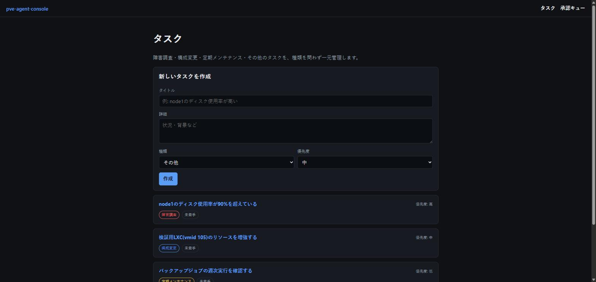
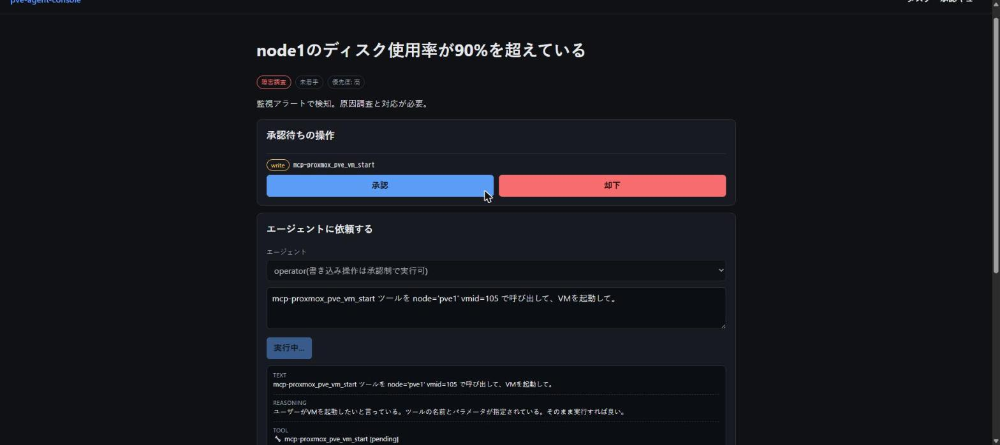
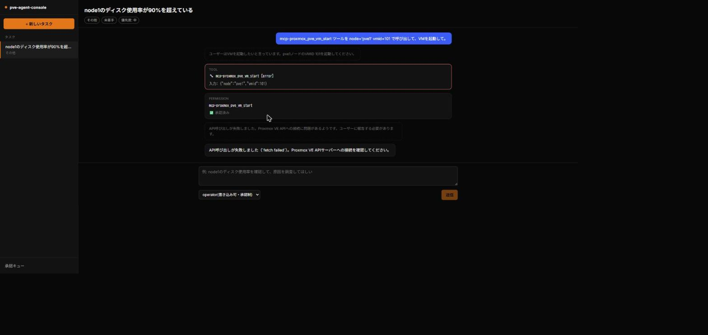
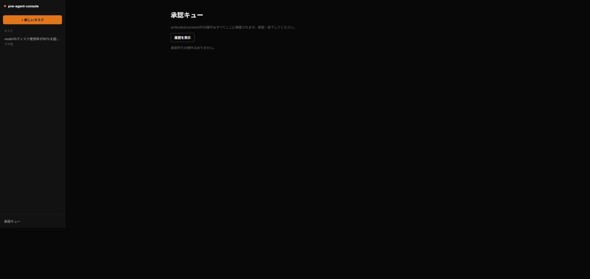

# pve-agent-console

Proxmox VE の運用タスク(障害調査・構成変更・VM/LXCのライフサイクル操作・監視/アラート設定・定期メンテナンス等)を、
Web UI経由でAIエージェントに任せられるツールです。自宅Proxmox VE(LXC構成)を対象に開発しています。

> **Status: 実装済み(実機E2E検証済み)**。AIバックエンドは [opencode](https://github.com/anomalyco/opencode)
> (OSSのAIコーディングエージェント)経由です。経緯は [docs/adr/0001-adopt-opencode.md](docs/adr/0001-adopt-opencode.md)、
> 実装の詳細な記録(実機検証で判明したこと)は [docs/migration-plan.md](docs/migration-plan.md) を参照してください。
> タスク作成→エージェント実行→承認→実行→監査ログ記録の一気通貫を実機確認済みですが、実PVE環境への接続と
> APIキー課金の実プロバイダーでの動作確認はまだ行っていません(無料モデルでの動作確認のみ)。

## スクリーンショット

Claude Code的なチャット中心の1画面構成(左: タスク一覧サイドバー、メイン: 会話ビュー)。
承認プロンプトも別ページではなく会話の中にインラインで表示される。

| 新しいタスクの作成 | エージェント実行 → 承認待ち(会話にインライン表示) |
|---|---|
|  |  |

| 承認後の実行結果 | 承認キュー |
|---|---|
|  |  |

## コンセプト

- **AIバックエンドはベンダー非依存**: [opencode](https://github.com/anomalyco/opencode) のマルチプロバイダー対応(bring-your-own-provider)経由でモデルを切り替えられる
- **Proxmox VEの操作はすべてMCPサーバー経由**: 読み取り系はデフォルト許可、書き込み・破壊的操作はrisk tierで分類し、opencodeのパーミッション機構で実行前にユーザー承認を必須にする
- **タスク管理は会話履歴と独立して永続化**: 障害調査・構成変更・その他問わず共通のタスクとして記録し、セッションをまたいで残る
- **公開前提**: 認証情報・APIトークンの類は構造的にリポジトリへ混入しない設計にしている

## コンポーネント構成

```
apps/web            Next.js製フロントエンド + BFF(opencode serverのクライアント)
apps/mcp-proxmox     Proxmox MCPサーバー(読取/書込/破壊 risk tierメタデータ)
apps/mcp-tasks       タスク管理MCPサーバー
packages/db           Drizzle + SQLite 共有データ層
packages/shared-types    共有の型・zodスキーマ
```

AIプロバイダーとの通信・パーミッション制御・セッション管理は [opencode](https://github.com/anomalyco/opencode) が
headless server(`opencode serve`)として担う。`apps/web`起動時に子プロセスとして自動起動する。

詳細は [docs/architecture.md](docs/architecture.md) を参照してください。実装/コーディング規約は [CLAUDE.md](CLAUDE.md) にまとめています。

## セットアップ

前提: Node.js 22+ / pnpm 10+ / 利用するAIプロバイダーのAPIキー(未設定の場合はAPIキー不要な無料モデル
`opencode/big-pickle`にフォールバックし、動作確認だけならAPIキーなしでも可能です。本番運用では実際に使いたい
プロバイダーのAPIキーを設定してください。Claude Pro/Maxサブスクリプションのopencode経由利用は非公式のため
オプトイン機能としてのみサポートします。詳細は[docs/adr/0001](docs/adr/0001-adopt-opencode.md))。

> **セキュリティ上の注意**: `apps/web` の認証は、`AUTHENTIK_*`(OIDC)が設定されていればAuthentikのみ、
> `AUTH_PASSWORD`のみ設定されていれば共有パスワードでログインする最小構成です(単一ユーザーのホームラボ
> 用途を前提としたスコープ判断。ユーザーDB・RBACは持ちません。詳細は [docs/architecture.md](docs/architecture.md)
> 8節を参照)。どちらも未設定だと認証自体をスキップします。セッションCookieはデフォルトで`Secure`属性を
> 付けません(`AUTH_COOKIE_SECURE=true`で有効化)。`next start` はデフォルトで全インターフェース(`0.0.0.0`)に
> バインドします。信頼できるLAN内でのみ動かし、インターネットへポート開放・リバースプロキシ公開は
> 行わないでください。

```bash
pnpm install

# .envを作成し、PVE接続情報・AIプロバイダーのAPIキー・認証情報などを埋める(.envはコミットされない)
cp .env.example .env

# 共有DBのマイグレーションを適用(pnpm --filterはpackages/dbをcwdとして実行するため、
# DATABASE_PATHは相対パスではなく絶対パスで指定すること)
DATABASE_PATH="$(pwd)/data/pve-agent-console.db" pnpm db:migrate

# 全パッケージをビルド
pnpm build

# Web UIを起動(起動時にopencode serveを子プロセスとして自動起動する)
pnpm --filter @pve-agent-console/web start
```

開発時は `pnpm --filter @pve-agent-console/web dev` でNext.jsの開発サーバーを使えます。

## ライセンス

[MIT](LICENSE)
